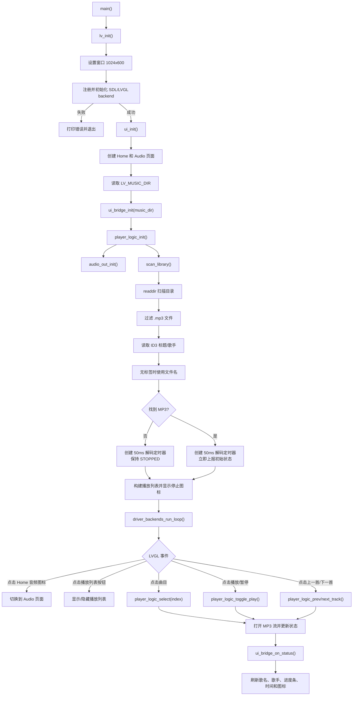
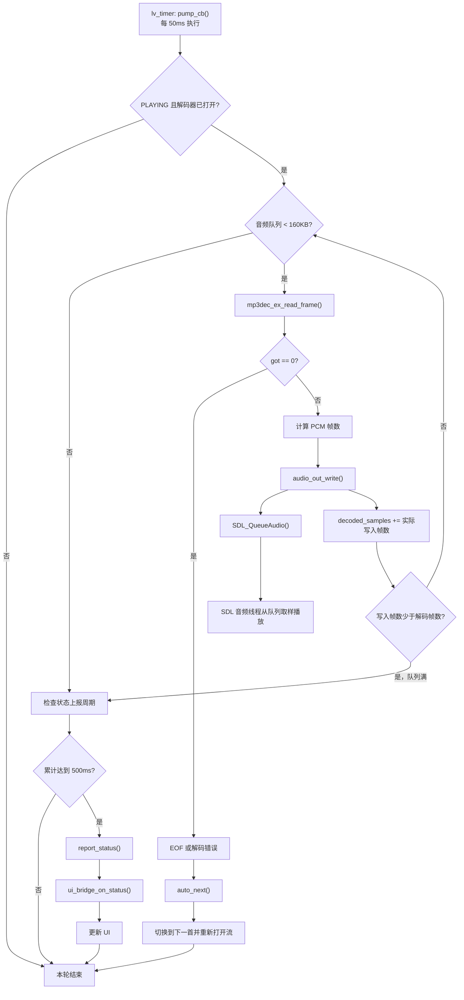

## 结论

`example/mp3_player` 是一个基于 LVGL 的单线程 MP3 播放器：

- `main.c` 负责初始化 LVGL、SDL、UI 和播放器。
- `ui/` 是 View，仅处理界面事件。
- `backend/ui_bridge.c` 负责 UI 与播放逻辑之间的桥接。
- `backend/player_logic.c` 负责扫描曲库、状态机和解码泵。
- `audio_out_sdl.c` 使用 SDL 队列音频输出，SDL 内部线程负责实际播放。

### 1. 启动与交互流程

### 2. 解码与播放流程

## 关键状态行为

| 当前状态 | 操作 | 结果 |
|---|---|---|
| `STOPPED` 且未选曲 | 播放 | 打开第 1 首并播放 |
| `PLAYING` | 播放/暂停 | 进入 `PAUSED` |
| `PAUSED` | 播放/暂停 | 恢复 `PLAYING` |
| `STOPPED` | 选曲、上一首、下一首 | 打开曲目但保持暂停 |
| `PLAYING/PAUSED` | 选曲、上一首、下一首 | 打开目标曲目并播放 |
| `PLAYING` 到 EOF | 自动切换 | 循环播放下一首 |

## 静态分析发现的几个问题

1. 播放列表索引读取方式不匹配：

   `make_row()` 将索引作为事件回调参数传入，但 `row_click_cb()` 使用的是 `lv_obj_get_user_data(row)`。两者不是同一个数据源，因此点击动态列表项时索引很可能始终为 `0`。

   - [ui_bridge.c:38](/home/tanxzh/tanxzh/lvgl/lv_port_linux/example/mp3_player/backend/ui_bridge.c:38)
   - [ui_bridge.c:75](/home/tanxzh/tanxzh/lvgl/lv_port_linux/example/mp3_player/backend/ui_bridge.c:75)
   - LVGL API 说明：[lv_event.h:199](/home/tanxzh/tanxzh/lvgl/lv_port_linux/lvgl/include/lvgl/core/lv_event.h:199)

   最小修复是让 `row_click_cb()` 使用 `lv_event_get_user_data(e)`。

2. 设计文档写的是“点击曲目出声”，但当前代码从 `STOPPED` 选曲时传入 `play=false`，实际会进入暂停状态：

   - [player_logic.c:375](/home/tanxzh/tanxzh/lvgl/lv_port_linux/example/mp3_player/backend/player_logic.c:375)
   - [player_logic.c:230](/home/tanxzh/tanxzh/lvgl/lv_port_linux/example/mp3_player/backend/player_logic.c:230)

3. 成功打开解码器后，外部的 `lv_fs_file_t` 没有对应关闭，切歌多次可能造成文件句柄泄漏：

   - [player_logic.c:185](/home/tanxzh/tanxzh/lvgl/lv_port_linux/example/mp3_player/backend/player_logic.c:185)
   - [player_logic.c:205](/home/tanxzh/tanxzh/lvgl/lv_port_linux/example/mp3_player/backend/player_logic.c:205)
   - [minimp3_ex.h:1368](/home/tanxzh/tanxzh/lvgl/lv_port_linux/example/mp3_player/backend/decoder/minimp3_ex.h:1368)

仓库设计文档记录逻辑层测试已通过，但 GUI 手工验收项目仍标记为待验证。未修改代码。
