## 结论

`example/mp3_player` 是一个基于 LVGL 的单线程 MP3 播放器：

- `main.c` 负责初始化 LVGL、SDL、UI 和播放器。
- `ui/` 是 View，仅处理界面事件。
- `backend/ui_bridge.c` 负责 UI 与播放逻辑之间的桥接。
- `backend/player_logic.c` 负责扫描曲库、状态机和解码泵。
- `audio_out_sdl.c` 使用 SDL 队列音频输出，SDL 内部线程负责实际播放。

### 1. 启动与交互流程

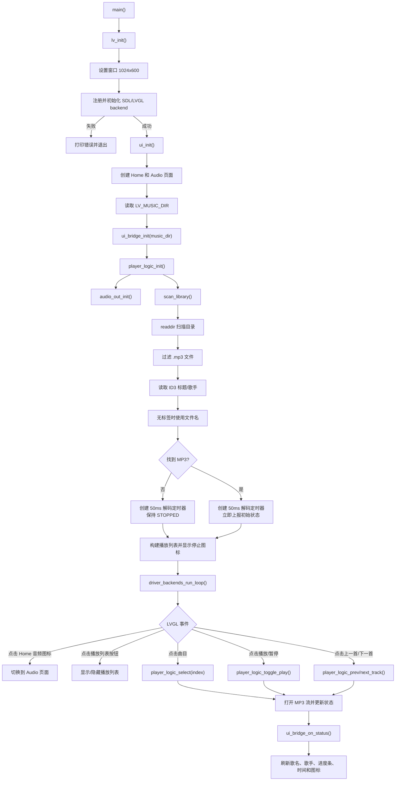

### 2. 解码与播放流程

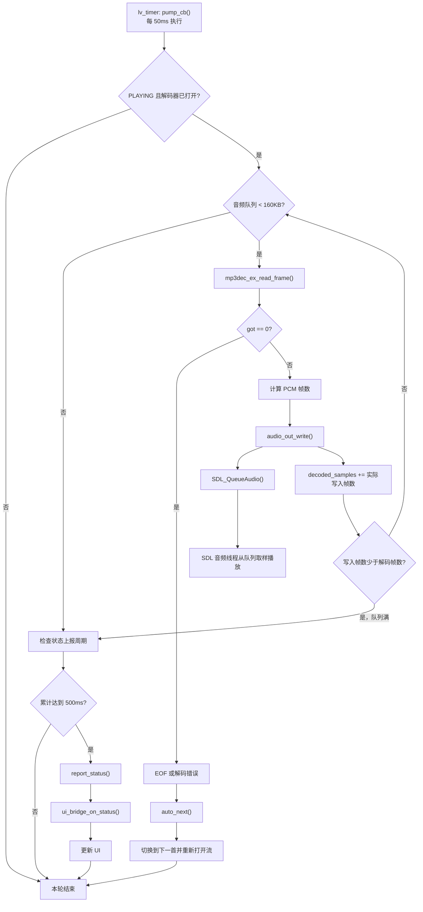

## 关键状态行为

| 当前状态 | 操作 | 结果 |
|---|---|---|
| `STOPPED` 且未选曲 | 播放 | 打开第 1 首并播放 |
| `PLAYING` | 播放/暂停 | 进入 `PAUSED` |
| `PAUSED` | 播放/暂停 | 恢复 `PLAYING` |
| `STOPPED` | 选曲、上一首、下一首 | 打开曲目但保持暂停 |
| `PLAYING/PAUSED` | 选曲、上一首、下一首 | 打开目标曲目并播放 |
| `PLAYING` 到 EOF | 自动切换 | 循环播放下一首 |

## 静态分析发现的几个问题

1. 播放列表索引读取方式不匹配：

   `make_row()` 将索引作为事件回调参数传入，但 `row_click_cb()` 使用的是 `lv_obj_get_user_data(row)`。两者不是同一个数据源，因此点击动态列表项时索引很可能始终为 `0`。

   - [ui_bridge.c:38](/home/tanxzh/tanxzh/lvgl/lv_port_linux/example/mp3_player/backend/ui_bridge.c:38)
   - [ui_bridge.c:75](/home/tanxzh/tanxzh/lvgl/lv_port_linux/example/mp3_player/backend/ui_bridge.c:75)
   - LVGL API 说明：[lv_event.h:199](/home/tanxzh/tanxzh/lvgl/lv_port_linux/lvgl/include/lvgl/core/lv_event.h:199)

   最小修复是让 `row_click_cb()` 使用 `lv_event_get_user_data(e)`。

2. 设计文档写的是“点击曲目出声”，但当前代码从 `STOPPED` 选曲时传入 `play=false`，实际会进入暂停状态：

   - [player_logic.c:375](/home/tanxzh/tanxzh/lvgl/lv_port_linux/example/mp3_player/backend/player_logic.c:375)
   - [player_logic.c:230](/home/tanxzh/tanxzh/lvgl/lv_port_linux/example/mp3_player/backend/player_logic.c:230)

3. 成功打开解码器后，外部的 `lv_fs_file_t` 没有对应关闭，切歌多次可能造成文件句柄泄漏：

   - [player_logic.c:185](/home/tanxzh/tanxzh/lvgl/lv_port_linux/example/mp3_player/backend/player_logic.c:185)
   - [player_logic.c:205](/home/tanxzh/tanxzh/lvgl/lv_port_linux/example/mp3_player/backend/player_logic.c:205)
   - [minimp3_ex.h:1368](/home/tanxzh/tanxzh/lvgl/lv_port_linux/example/mp3_player/backend/decoder/minimp3_ex.h:1368)

仓库设计文档记录逻辑层测试已通过，但 GUI 手工验收项目仍标记为待验证。未修改代码。


# Code

## ui_init

## ui_bridge_init
```
player_logic_init()
   audio_out_init --> SDL
   scan_library() --. .mp3 file
   lv_timer_create(50ms) --> pump_cb()
      如果不是 PL_PLAYING 状态，直接返回，现在默认是 STOPPED，后续按键来切换状态
      解码，直到 queue 满，并且播出去；上报状态给 UI 用于刷新
   上报初始状态给 UI

build_playlist() --> 把上面扫描的 .mp3 文件添加到播放列表
   把 track 信息保存到 out 中，也就是放到播放列表中，一个表格
      其中的 track 来自 scan_library() 扫描的 .mp3 文件，会把 .mp3 文件的信息填充到 tracks 中
   表格有 click cb，点击表格项时，调用 player_logic_select(index) 选曲
      获取 row 和 index，调用 player_logic_select(index) 选曲

update_transport_icons() --> 更新播放/暂停图标
```


下面按当前代码分析，重点是回调注册、事件分发以及它们和播放器后端的连接关系。

## 一、总体关系

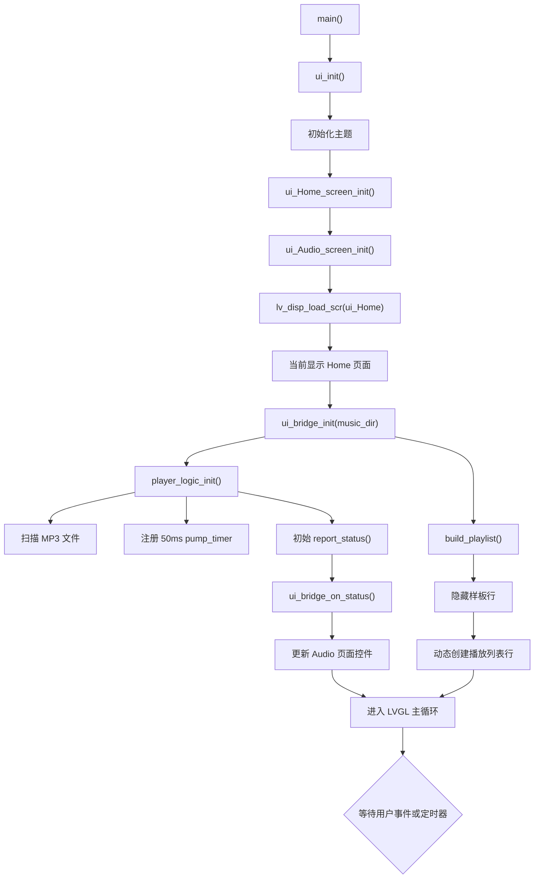

入口代码位于：

- [main.c:39](/home/tanxzh/tanxzh/lvgl/lv_port_linux/example/mp3_player/main.c:39)
- [ui.c:27](/home/tanxzh/tanxzh/lvgl/lv_port_linux/example/mp3_player/ui/ui.c:27)
- [ui_bridge.c:149](/home/tanxzh/tanxzh/lvgl/lv_port_linux/example/mp3_player/backend/ui_bridge.c:149)

`ui_init()` 会一次性创建 Home 和 Audio 两个页面，随后只显示 Home 页面。因此第一次进入 Audio 时，Audio 页面通常已经创建好了，不会重新执行初始化。

---

## 二、初始化后如何进入 Audio 页面

Home 页面中有两个回调：

```c
ui_event_ContainerAudio()
ui_event_AudioIcon()
```

注册位置：

- [ui_Home.c:192](/home/tanxzh/tanxzh/lvgl/lv_port_linux/example/mp3_player/ui/screens/ui_Home.c:192)
- [ui_Home.c:193](/home/tanxzh/tanxzh/lvgl/lv_port_linux/example/mp3_player/ui/screens/ui_Home.c:193)

两者最终都调用：

```c
_ui_screen_change(&ui_Audio,
                  LV_SCR_LOAD_ANIM_FADE_ON,
                  500,
                  0,
                  &ui_Audio_screen_init);
```

调用链如下：

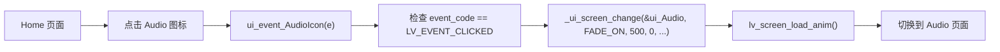

具体代码：

- [ui_Home.c:25](/home/tanxzh/tanxzh/lvgl/lv_port_linux/example/mp3_player/ui/screens/ui_Home.c:25)
- [ui_Home.c:34](/home/tanxzh/tanxzh/lvgl/lv_port_linux/example/mp3_player/ui/screens/ui_Home.c:34)
- [_ui_screen_change](/home/tanxzh/tanxzh/lvgl/lv_port_linux/example/mp3_player/ui/ui_helpers.c:49)

### 实际可点击对象

`ui_ContainerAudio` 被设置为不可点击：

```c
lv_obj_remove_flag(ui_ContainerAudio, LV_OBJ_FLAG_CLICKABLE);
```

而 `ui_AudioIcon` 被设置为可点击：

```c
lv_obj_add_flag(ui_AudioIcon, LV_OBJ_FLAG_CLICKABLE);
```

所以实际进入 Audio 页面时，应该点击 Audio 图标，而不是外层 Container。

`ui_event_ContainerAudio()` 虽然存在并且注册了，但当前外层 Container 不可点击，通常不会成为实际事件目标。

---

## 三、Audio 页面默认界面

Audio 页面由 [ui_Audio_screen_init()](/home/tanxzh/tanxzh/lvgl/lv_port_linux/example/mp3_player/ui/screens/ui_Audio.c:94) 创建。

初始控件状态如下：

| 控件 | 默认状态 |
|---|---|
| 背景 | `ui_img_audio_background_png` |
| 封面 | 默认封面 `ui_img_def_cover_png` |
| 歌曲名 | `"song"`，之后可能被状态回调覆盖 |
| 歌手名 | `"songer"`，之后可能被状态回调覆盖 |
| 播放进度条 | 初始值 25，之后由播放器状态覆盖 |
| 当前时间 | `00:00` |
| 总时间 | `00:00` |
| 播放列表面板 | 隐藏 |
| 歌词面板 | 空面板 |
| 播放按钮 | 显示 |
| 暂停按钮 | 隐藏 |
| 上一首按钮 | 显示 |
| 下一首按钮 | 显示 |
| 返回 Home 按钮 | 显示 |

主要初始化代码：

- 歌曲信息：[ui_Audio.c:100-126](/home/tanxzh/tanxzh/lvgl/lv_port_linux/example/mp3_player/ui/screens/ui_Audio.c:100)
- 进度条和时间：[ui_Audio.c:128-154](/home/tanxzh/tanxzh/lvgl/lv_port_linux/example/mp3_player/ui/screens/ui_Audio.c:128)
- 播放列表：[ui_Audio.c:156-212](/home/tanxzh/tanxzh/lvgl/lv_port_linux/example/mp3_player/ui/screens/ui_Audio.c:156)
- 播放控制按钮：[ui_Audio.c:225-275](/home/tanxzh/tanxzh/lvgl/lv_port_linux/example/mp3_player/ui/screens/ui_Audio.c:225)

正常找到 MP3 后，`player_logic_init()` 会立即上报一次状态。此时还没有选择曲目：

```text
cur   = -1
state = PL_STOPPED
```

所以状态回调会将歌曲名、歌手名、时间和进度重置为空或 `00:00`。

---

## 四、Audio 页面所有事件回调

Audio 页面注册了 7 个 LVGL 事件回调：

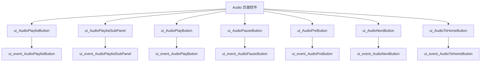

注册位置：

- [ui_Audio.c:277-283](/home/tanxzh/tanxzh/lvgl/lv_port_linux/example/mp3_player/ui/screens/ui_Audio.c:277)

所有事件都使用 `LV_EVENT_ALL` 注册，但回调内部只处理：

```c
event_code == LV_EVENT_CLICKED
```

因此真正有效的事件是点击事件。

---

## 五、播放按钮和暂停按钮

### 播放按钮

调用链：

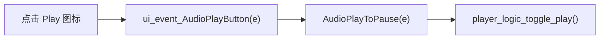

代码位置：

- [ui_Audio.c:47-54](/home/tanxzh/tanxzh/lvgl/lv_port_linux/example/mp3_player/ui/screens/ui_Audio.c:47)
- [ui_events.c:20-24](/home/tanxzh/tanxzh/lvgl/lv_port_linux/example/mp3_player/ui/ui_events.c:20)

### 暂停按钮

调用链：

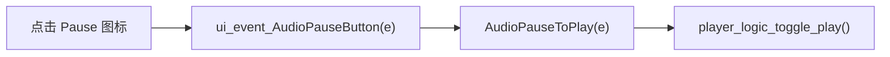

代码位置：

- [ui_Audio.c:56-63](/home/tanxzh/tanxzh/lvgl/lv_port_linux/example/mp3_player/ui/screens/ui_Audio.c:56)
- [ui_events.c:26-30](/home/tanxzh/tanxzh/lvgl/lv_port_linux/example/mp3_player/ui/ui_events.c:26)

两个 UI 回调最终都调用同一个后端函数：

```c
player_logic_toggle_play();
```

也就是说，播放和暂停并没有各自维护状态，而是由播放器当前状态决定下一步动作。

### 播放状态变化

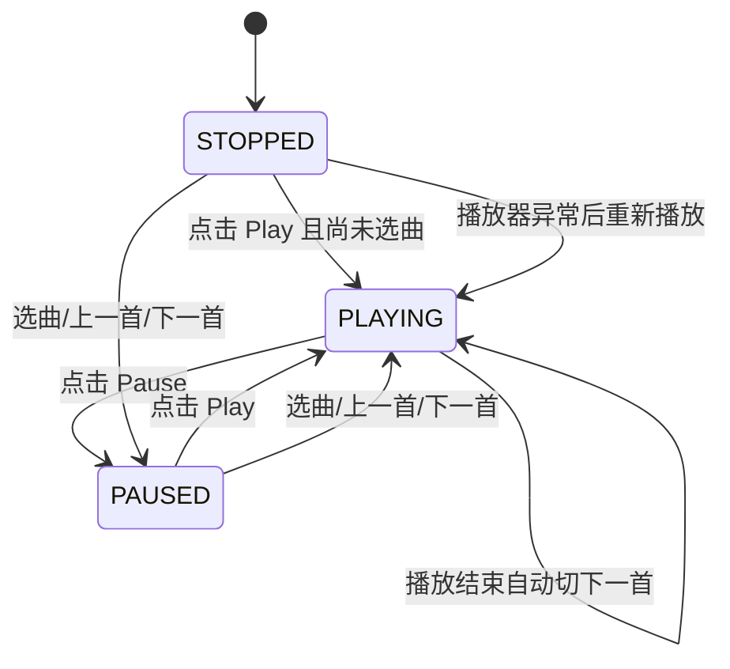

如果还没有选曲：

```c
if(cur < 0) {
    if(track_count > 0) start_track(0, true);
}
```

因此第一次点击播放会自动打开第 0 首并播放。

代码位置：

- [player_logic.c:341-359](/home/tanxzh/tanxzh/lvgl/lv_port_linux/example/mp3_player/backend/player_logic.c:341)

---

## 六、播放列表按钮

点击播放列表按钮的调用链：

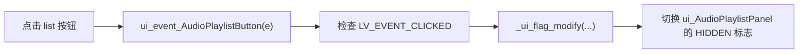

代码位置：

- [ui_Audio.c:29-35](/home/tanxzh/tanxzh/lvgl/lv_port_linux/example/mp3_player/ui/screens/ui_Audio.c:29)
- [ui_helpers.c:89-97](/home/tanxzh/tanxzh/lvgl/lv_port_linux/example/mp3_player/ui/ui_helpers.c:89)

这个事件只负责显示或隐藏播放列表，不会：

- 播放歌曲
- 暂停歌曲
- 修改当前曲目
- 重新扫描目录

播放列表是在启动阶段由 `ui_bridge_init()` 创建的：

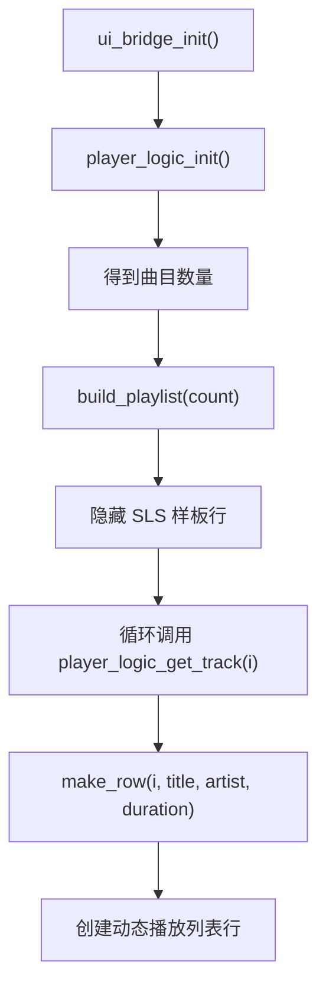

代码位置：

- [ui_bridge.c:149-155](/home/tanxzh/tanxzh/lvgl/lv_port_linux/example/mp3_player/backend/ui_bridge.c:149)
- [ui_bridge.c:78-99](/home/tanxzh/tanxzh/lvgl/lv_port_linux/example/mp3_player/backend/ui_bridge.c:78)

---

## 七、点击播放列表中的曲目

这里实际上存在两条路径。

### 路径一：动态创建的播放列表行

动态行由 `make_row()` 创建，并注册：

```c
lv_obj_add_event_cb(row,
                    row_click_cb,
                    LV_EVENT_CLICKED,
                    (void *)(intptr_t)index);
```

调用链：

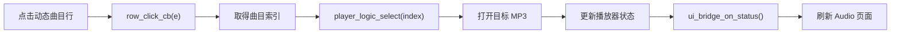

代码位置：

- [ui_bridge.c:34-39](/home/tanxzh/tanxzh/lvgl/lv_port_linux/example/mp3_player/backend/ui_bridge.c:34)
- [ui_bridge.c:41-75](/home/tanxzh/tanxzh/lvgl/lv_port_linux/example/mp3_player/backend/ui_bridge.c:41)

### 当前代码存在的索引问题

注册回调时，索引传入的是事件回调用户数据：

```c
(void *)(intptr_t)index
```

但回调读取的是对象用户数据：

```c
lv_obj_get_user_data(row)
```

这两者不是同一个数据源。

正确读取方式应该是：

```c
intptr_t idx = (intptr_t)lv_event_get_user_data(e);
```

所以当前代码中，动态播放列表的点击事件虽然能进入 `row_click_cb()`，但曲目索引可能始终是 `0` 或无效值。

### 路径二：SquareLine 原始样板行

`ui_AudioPlaylistSubPanel` 注册了：

```c
ui_event_AudioPlaylistSubPanel()
```

该回调再转发到：

```c
on_track_item_clicked(e)
```

调用链：

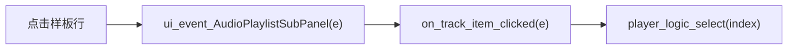

代码位置：

- [ui_Audio.c:38-45](/home/tanxzh/tanxzh/lvgl/lv_port_linux/example/mp3_player/ui/screens/ui_Audio.c:38)
- [ui_events.c:14-18](/home/tanxzh/tanxzh/lvgl/lv_port_linux/example/mp3_player/ui/ui_events.c:14)

但是启动时 `ui_bridge.c` 会隐藏这个样板行：

```c
lv_obj_add_flag(ui_AudioPlaylistSubPanel, LV_OBJ_FLAG_HIDDEN);
```

因此正常运行时真正使用的是动态行的 `row_click_cb()`，不是 `ui_event_AudioPlaylistSubPanel()`。

---

## 八、选曲后的行为

点击曲目最终调用：

```c
player_logic_select(index);
```

代码：

```c
void player_logic_select(int index)
{
    if(index < 0 || index >= track_count) return;

    start_track(index,
                state == PL_STOPPED ? false : true);
}
```

这里有一个重要行为：

| 选曲前状态 | 选曲后的状态 |
|---|---|
| `STOPPED` | 打开目标曲目，但保持 `PAUSED` |
| `PLAYING` | 打开目标曲目并立即播放 |
| `PAUSED` | 打开目标曲目并立即播放 |

因此首次进入 Audio 页面后，如果播放器是 `STOPPED`，点击曲目不会自动发声，还需要再点击播放按钮。

代码位置：

- [player_logic.c:375-379](/home/tanxzh/tanxzh/lvgl/lv_port_linux/example/mp3_player/backend/player_logic.c:375)
- [player_logic.c:224-238](/home/tanxzh/tanxzh/lvgl/lv_port_linux/example/mp3_player/backend/player_logic.c:224)

---

## 九、上一首和下一首

### 上一首

调用链：

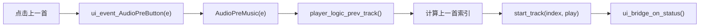

代码位置：

- [ui_Audio.c:65-72](/home/tanxzh/tanxzh/lvgl/lvgl_port_linux/example/mp3_player/ui/screens/ui_Audio.c:65)
- [ui_events.c:32-36](/home/tanxzh/tanxzh/lvgl/lvgl_port_linux/example/mp3_player/ui/ui_events.c:32)
- [player_logic.c:368-373](/home/tanxzh/tanxzh/lvgl/lvgl_port_linux/example/mp3_player/backend/player_logic.c:368)

上一首会循环：

```text
当前是第 0 首 → 切换到最后一首
```

### 下一首

调用链：

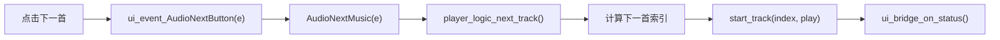

代码位置：

- [ui_Audio.c:74-81](/home/tanxzh/tanxzh/lvgl/lv_port_linux/example/mp3_player/ui/screens/ui_Audio.c:74)
- [ui_events.c:38-42](/home/tanxzh/tanxzh/lvgl/lv_port_linux/example/mp3_player/ui/ui_events.c:38)
- [player_logic.c:361-366](/home/tanxzh/tanxzh/lvgl/lv_port_linux/example/mp3_player/backend/player_logic.c:361)

下一首会循环：

```text
当前是最后一首 → 切换到第 0 首
```

如果当前曲库为空，上一首和下一首直接返回，不做任何操作。

---

## 十、状态如何回写到 UI

UI 事件只调用播放器 API，真正刷新界面的是 `ui_bridge_on_status()`。

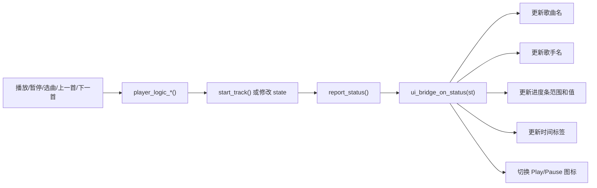

状态回调注册位置：

```c
player_logic_init(music_dir, ui_bridge_on_status, NULL);
```

代码位置：

- [ui_bridge.c:149-155](/home/tanxzh/tanxzh/lvgl/lv_port_linux/example/mp3_player/backend/ui_bridge.c:149)
- [ui_bridge.c:117-143](/home/tanxzh/tanxzh/lvgl/lv_port_linux/example/mp3_player/backend/ui_bridge.c:117)

### 回调更新内容

`ui_bridge_on_status()` 会更新：

```text
ui_AudioSongLabel
ui_AudioSongerLabel
ui_AudioPlayBar
ui_AudioCurrentTimeLabel
ui_AudioTotalTimeLabel
ui_AudioPlayButton
ui_AudioPauseButton
```

其中：

```text
PL_PLAYING:
    隐藏 Play
    显示 Pause

PL_PAUSED / PL_STOPPED:
    显示 Play
    隐藏 Pause
```

这样 UI 图标不会单独维护状态，而是始终以播放器状态为准。

---

## 十一、播放过程中的定时器回调

播放器初始化时创建一个 50ms 定时器：

```c
pump_timer = lv_timer_create(pump_cb, PL_PUMP_PERIOD_MS, NULL);
```

每 50ms 执行一次：

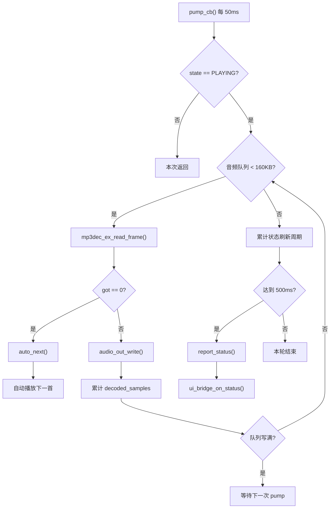

代码位置：

- [player_logic.c:272-304](/home/tanxzh/tanxzh/lvgl/lv_port_linux/example/mp3_player/backend/player_logic.c:272)
- [player_logic.c:310-329](/home/tanxzh/tanxzh/lvgl/lv_port_linux/example/mp3_player/backend/player_logic.c:310)

所以播放时，Audio 页面不是通过某个 UI 回调持续刷新，而是由播放器定时器定期触发状态回调。

---

## 十二、返回 Home 页面

返回按钮的调用链：

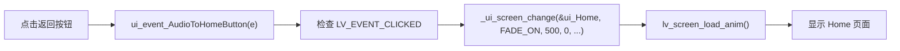

代码位置：

- [ui_Audio.c:83-90](/home/tanxzh/tanxzh/lvgl/lv_port_linux/example/mp3_player/ui/screens/ui_Audio.c:83)

注意：返回 Home 只切换页面，不会调用：

```c
player_logic_toggle_play();
audio_out_pause(true);
player_logic_stop();
```

因此：

- 如果返回时正在播放，音乐会继续播放。
- 50ms 的播放器定时器仍然继续运行。
- 状态回调仍然会更新 Audio 页面控件。
- 再次进入 Audio 时，播放状态不会被重置。

由于 Home 和 Audio 都在 `ui_init()` 中创建，返回和再次进入通常只是切换已有页面，不会重新初始化整个页面。

---

## 十三、当前真正参与事件链的回调

### Home 页面

| 回调 | 作用 | 当前是否实际使用 |
|---|---|---|
| `ui_event_AudioIcon` | 点击 Audio 图标进入 Audio | 是 |
| `ui_event_ContainerAudio` | 点击外层音频容器进入 Audio | 外层不可点击，基本不触发 |

### Audio 页面

| 回调 | 作用 | 下一步 |
|---|---|---|
| `ui_event_AudioPlaylistButton` | 显示/隐藏播放列表 | `_ui_flag_modify()` |
| `ui_event_AudioPlaylistSubPanel` | 样板行点击 | `on_track_item_clicked()`，但样板行被隐藏 |
| `ui_event_AudioPlayButton` | 播放按钮点击 | `AudioPlayToPause()` |
| `ui_event_AudioPauseButton` | 暂停按钮点击 | `AudioPauseToPlay()` |
| `ui_event_AudioPreButton` | 上一首 | `AudioPreMusic()` |
| `ui_event_AudioNextButton` | 下一首 | `AudioNextMusic()` |
| `ui_event_AudioToHomeButton` | 返回 Home | `_ui_screen_change()` |

### `ui_events.c` 中的转发回调

这些函数本身几乎没有业务逻辑，只是把 UI 事件转发到播放器：

- `on_track_item_clicked`
- `AudioPlayToPause`
- `AudioPauseToPlay`
- `AudioPreMusic`
- `AudioNextMusic`

位置：[ui_events.c](/home/tanxzh/tanxzh/lvgl/lv_port_linux/example/mp3_player/ui/ui_events.c)

### Backend 中的 UI 相关回调

- `row_click_cb()`：动态播放列表行的点击回调。
- `ui_bridge_on_status()`：播放器状态回写 UI 的回调。
- `update_transport_icons()`：根据播放状态切换图标。

位置：[ui_bridge.c](/home/tanxzh/tanxzh/lvgl/lv_port_linux/example/mp3_player/backend/ui_bridge.c)

## 最关键的事件链

```text
Home AudioIcon
    → ui_event_AudioIcon
    → _ui_screen_change
    → Audio 页面

Audio Play/Pause
    → ui_event_AudioPlayButton / ui_event_AudioPauseButton
    → AudioPlayToPause / AudioPauseToPlay
    → player_logic_toggle_play
    → report_status
    → ui_bridge_on_status
    → 更新按钮、进度、时间

Audio 上一首/下一首
    → ui_event_AudioPreButton / ui_event_AudioNextButton
    → AudioPreMusic / AudioNextMusic
    → player_logic_prev_track / player_logic_next_track
    → start_track
    → report_status
    → ui_bridge_on_status

播放列表行
    → row_click_cb
    → player_logic_select
    → start_track
    → report_status
    → ui_bridge_on_status

Audio 返回按钮
    → ui_event_AudioToHomeButton
    → _ui_screen_change
    → Home 页面
```

当前最需要注意的是：动态播放列表行的索引通过事件回调参数传入，却通过对象 user data 读取，导致选曲索引存在错误风险。